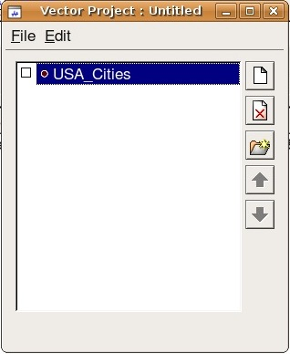

===================
Non-clickable icons
===================

.. container::

   .. container:: sidebar1

      :doc:`6153619`

      :doc:`6053241`

      :doc:`172810`

      :doc:`1090589`

      :doc:`173054`

      :doc:`2882131`

      :doc:`2760298`

      :doc:`4525555`

      :doc:`6062318`

      :doc:`6081009`

      :doc:`6081069`

      :doc:`2760457`

      :doc:`2760534`

      :doc:`173053`

      :doc:`1089795`

      :doc:`4492623`

      :doc:`2760655`

   .. container:: content

      |Google logo|

      .. rubric:: `Google Earth Enterprise Documentation
         Home <../index.html>`__ \| Fusion resources and projects

      .. rubric:: Non-clickable icons

      By default, any point icon that you configure in Fusion displays a
      pop-up balloon whenever EC users click it. You can configure the
      pop-up balloons to display information about the point. An example
      is shown below.

      However, if you do not want an icon to display a pop-up balloon,
      you can use one of Fusion's **Advanced** options to make it a
      non-clickable icon. (Non-clickable icons are point icons that
      do not change when clicked.)

      |Clickable icon example|

      .. rubric:: To create a non-clickable icon:

      #. Add a new point vector resource to a vector project. In the
         example below, the point vector resource is called
         **USA_Cities**.

         |Point layer resource example|

      #. Assign filters, icon types, and minimum and maximum visibility
         display rule settings to the point layer.

         |Vector Display Rules window|

      #. In the **Balloon** section, change the **Style** from
         **Default** to **Advanced**.

         |Balloon style options|

      #. Leave the **Text** field and the **Advanced** field empty.

         |Balloon style - Advanced|

      #. Click **Advanced**. The **Balloon Style Text** window appears.

         |Balloon Style Text window|

      #. Click **Insert Default Text**.
      #. Remove all text except: $[description].
      #. Click **OK** twice to exit all windows.
      #. **Save** and **Build** the vector project.
      #. Build the 3D database, then publish to Fusion.

         You can now view the non-clickable icon in EC.

      .. container:: footer

         `Back to top <#top_of_file>`__

         --------------

.. |Google logo| image:: ../art/common/googlelogo_color_260x88dp.png
   :width: 130px
   :height: 44px
.. |Clickable icon example| image:: ../art/fusion/projects/2964717_clickable_icon.jpg

.. |Vector Display Rules window| image:: ../art/fusion/projects/2966091_vector_display_rules.jpg
.. |Balloon style options| image:: ../art/fusion/projects/2966060_balloon_style_options.jpg
.. |Balloon style - Advanced| image:: ../art/fusion/projects/2966075_balloon_style_advanced.jpg
.. |Balloon Style Text window| image:: ../art/fusion/projects/2966062_balloon_style_text.jpg
