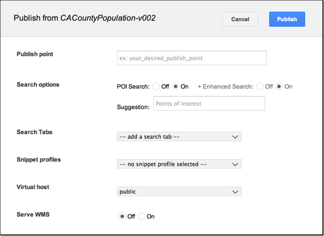

===============================
Publish databases and portables
===============================

.. container::

   .. container:: sidebar1

      :doc:`3468004`

      :doc:`3470759`

      :doc:`3479919`

      :doc:`3480095`

      :doc:`3479921`

      :doc:`3480097`

      :doc:`3479922`

      :doc:`3497763`

      :doc:`6004748`

      :doc:`176770`

      :doc:`6013604`

      :doc:`4441137`

      :doc:`6062970`

      :doc:`6063101`

      :doc:`3497832`

      :doc:`6066597`

      :doc:`6082250`

      :doc:`6091774`

      :doc:`6091810`

      :doc:`3230777`

      :doc:`4643041`

      :doc:`6051534`

      :doc:`6051659`

      :doc:`6051568`

      :doc:`(Deprecated) Provide Google Earth Plugin for your users to
      install <6051584>`

   .. container:: content

      |Google logo|

      .. rubric:: `Google Earth Enterprise Documentation
         Home <../index.html>`__ \| GEE Server administration

      .. rubric:: Publish databases and portables

      When you *publish* a Fusion database, you select the database you
      want to publish, specify a *publish point*, then apply *publishing
      options* in the **Publish** dialog. Before you publish a Fusion
      database, you must register it by
      :doc:`pushing <6034724>` it to :doc:`GEE
      Server <3468004>`.

      With portable files, the process is a little different. Instead,
      first you *register* your portable globes and maps in the **Manage
      Portables** dialog before publishing them. Registering a portable
      globe or map is similar to *pushing* a database from Fusion.

      -  :ref:`Publish a Fusion database <Publish_Fusion_Database>`
      -  :ref:`Register and publish a portable globe or
         map <Register_Publish_Portable_Map_Globe>`

      .. _Publish_Fusion_Database:
      .. rubric:: Publish a Fusion database

      .. rubric:: To publish a Fusion database:

      #. In the :doc:`GEE Server Admin console <3470759>`,
         click **Databases**.
      #. Check the box next to the database or portable to publish.
      #. Click the **Publish** button to open the Publish dialog.

         |Publish dialog example|

      #. Specify a **Publish point**, which is where you access the
         database or portable. For example, if you specify
         *sanfrancisco*, it will be accessible from
         *myserver.mydomainname*.com/sanfrancisco.

         .. note::

            **Note:** When publishing a database, the publish point you
            specify is case-*insensitive*. Upper and lower case are not
            differentiated. Make sure each publish point path name you
            specify is unique.

      #. Specify the following options:

         #. **POI Search** (Fusion databases with search data only)
         #. **Search Tabs** (Fusion databases only)
         #. **Snippet profile** (Fusion 3D databases only)

      #. Select a **Virtual host**.
      #. Optionally enable **Serve WMS.**
      #. Click the **Publish** button. The **Databases** page updates to indicate
         the published status of your database.

      .. _Register_Publish_Portable_Map_Globe:
      .. rubric:: To register a portable globe or map:

      #. In the :doc:`GEE Server Admin console <3470759>`,
         click **Databases**.
      #. Click **Manage Portables** to open the Manage portable globes
         dialog.

         |Manage Portables dialog example|

         The list of globes and maps corresponds to the files located in
         the default ``/opt/google/gehttpd/htdocs/cutter/globes``
         directory.

      #. Click **Register** next to the globe or map that you want to
         make available for publishing on GEE Server. The registered
         globe or map appears in the list on the **Databases** page of
         the Admin console.

         You can register as many portable globes or maps as you have
         listed in the dialog. 
         Click **Unregister** to make a globe or
         map unavailable on GEE Server.

      #. On the **Databases** page of the Admin console, check the box
         next to the portable globe or map you wish to publish.
      #. Click **Publish** to open the Publish dialog.
      #. Specify a **Publish point**, where the portable will be
         accessible from. For example, if you specify *grandcanyon*, it
         will be accessible from
         *myserver.mydomainname*.com/grandcanyon.

         .. note::

            **Note:** When publishing a database, the publish point you
            specify is case-*insensitive*. Upper and lower case are not
            differentiated. Make sure each publish point path name you
            specify is unique.

      #. Select a **Virtual host**.
      #. Click the **Publish** button. The **Databases** page updates to indicate
         the published status of your portable globe or map.

      .. rubric:: Learn more

      -  :doc:`6004748`
      -  :doc:`6013604`
      -  :doc:`4441137`
      -  :doc:`3230777`

      .. container:: footer

         `Back to top <#top_of_file>`__

         --------------

.. |Google logo| image:: ../art/common/googlelogo_color_260x88dp.png
   :width: 130px
   :height: 44px

.. |Manage Portables dialog example| image:: ../art/server/publish_databases/ManagePortablesdialog.png
