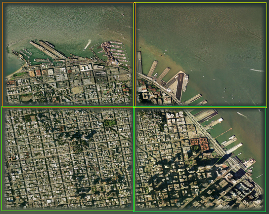
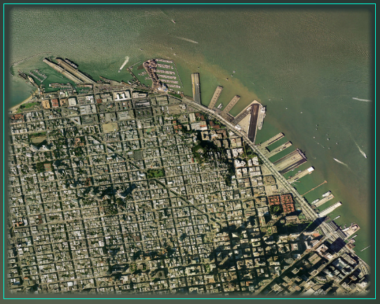

==============================
Segmenting Large Imagery Files
==============================

.. container::

   .. container:: sidebar1

      :doc:`4412440`

      :doc:`4412441`

      :doc:`4412443`

      :doc:`4412421`

      :doc:`4412422`

      :doc:`4412446`

      :doc:`4412447`

      :doc:`4412681`

      :doc:`4412449`

      :doc:`4412684`

      :doc:`4412683`

      :doc:`4412455`

      :doc:`4412688`

      :doc:`4412689`

      :doc:`4412458`

      :doc:`4412690`

      :doc:`6028272`

   .. container:: content

      |Google logo|

      .. rubric:: `Google Earth Enterprise Documentation
         Home <../index.html>`__ \| Fusion tutorial
         :name: google-earth-enterprise-documentation-home-fusion-tutorial

      .. rubric:: Segmenting Large Imagery Files
         :name: segmenting-large-imagery-files

      Google Earth Enterprise Fusion does not allow you to import raw
      imagery source files larger than 80 GB. (Raw size = number of
      pixels width \* number of pixels height \* 3.) Therefore, if you
      have an imagery source file that is larger than 80 GB, you can
      split it into two or more source files using the ``gesplitkhvr``
      command.

      The ``gesplitkhvr`` tool produces a grid of image files designated
      as rows and columns. For example, if you specify two rows by two
      columns, the image is split into four smaller files. If you create
      a separate resource for each resulting source file, it would look
      like this in the Preview pane:

      |Split Image|
      However, you can reconnect the split images by adding them all to
      a single resource, which would look like this in the Preview pane:

      |Split Images Reconnected Into a Single Resource|
      .. rubric:: To split a large source file into multiple smaller
         files:
         :name: to-split-a-large-source-file-into-multiple-smaller-files

      #. At the command prompt, change to the folder that contains the
         tutorial imagery source files by entering:

         ``cd /opt/google/share/tutorials/fusion/Imagery``

      #. Convert a ``.tif`` file to a ``.khvr`` file by entering:

         ``gevirtualraster -o path/virtual_raster.khvr usgsSFHiRes.tif``

         where *path* is the path to the folder where you want to save
         the resulting ``.khvr`` file. (See :doc:`4412688` for more information about
         the ``gevirtualraster`` tool.)

         .. note::

            **Note:** The path where you save the resulting ``.khvr``
            file must be on a known volume. (See
            “\ ``geconfigureassetroot --editvolumes``\ ” in the :doc:`3481558`.)

      #. Change to the folder where you stored the virtual_raster.khvr
         (the value of *path* in step 2) by entering:

         ``cd path``

      #. Split the ``.khvr`` file into a 4x4 grid (16 image files) with
         a 10-pixel overlap among all of the files by entering:

         ``gesplitkhvr --rows 4 --cols 4 --overlap 10 virtual_raster.khvr``

         The names of the resulting files appear on the screen as they
         are created. The file names are constructed from the name of
         the original file (``virtual_raster``), a row and column
         designation for each file (starting with ``-R1C3``), and the
         ``.khvr`` extension.

      Now you can import the 16 resulting image files into a resource.

      .. container:: footer

         `Back to top <#top_of_file>`__

         --------------

         ©2015 Google

.. |Google logo| image:: ../art/common/googlelogo_color_260x88dp.png
   :width: 130px
   :height: 44px

