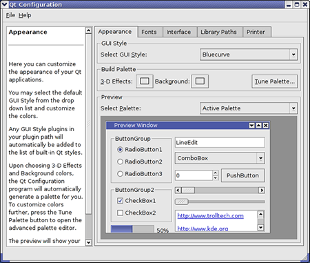

==============================
Configure font size in the GUI
==============================

.. container::

   .. container:: sidebar1

      :doc:`3481464`

      :doc:`6008655`

      :doc:`7160005`

      :doc:`176738`

      :doc:`6033487`

      :doc:`3481501`

      :doc:`3481506`

      :doc:`3481478`

      :doc:`3481512`

      :doc:`3481546`

      :doc:`2760661`

      :doc:`176676`

      :doc:`6035839`

      :doc:`3481499`

      :doc:`6034724`

      :doc:`6051700`

      :doc:`6086672`

      :doc:`3481558`

   .. container:: content

      |Google logo|

      .. rubric:: `Google Earth Enterprise Documentation
         Home <../index.html>`__ \| Fusion administration
         :name: google-earth-enterprise-documentation-home-fusion-administration

      .. rubric:: Configure font size in the GUI

      If you want to customize certain aspects of the Google Earth
      Enterprise Fusion GUI (such as menus, button labels, tables,
      lists, etc.), you can use a graphical configuration tool
      called Qt Configuration to customize the font size and other GUI
      features.

      .. rubric:: To customize the appearance of the Google Earth
         Enterprise Fusion GUI:

      #. On the command line, change directory to
         ``/opt/google/qt/bin/`` and enter ``./qtconfig``.

         The Qt Configuration dialog appears.

         |image1|

      #. Click the tabs at the top of the right side of the window to
         view the available options, and use the help text on the left
         side for help with each tab.

         .. note::

            **Note:** The Qt Configuration tool is not a Google product.
            For more information about Qt Configuration, select either
            of the options on the **Help** menu.

      .. container:: footer

         `Back to top <#top_of_file>`__

         --------------

         ©2015 Google

.. |Google logo| image:: ../art/common/googlelogo_color_260x88dp.png
   :width: 130px
   :height: 44px

