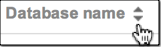
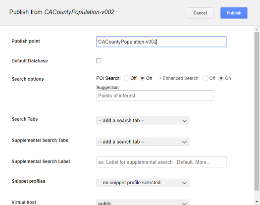

|Google logo|

==========================
Push and publish databases
==========================

.. container::

   .. container:: content

      Pushing a database is the process of making a Google Earth
      Enterprise Fusion database available on a Google Earth Enterprise
      server so that it can then be published for viewing with Google
      Earth EC.

      The *push* operation copies all the necessary files associated
      with a given 2D/3D Fusion database version to Google Earth
      Enterprise Server and registers the database. Pushing is performed
      from Fusion.

      The *publish* operation makes a previously pushed database
      available for serving at a specified publish point. Publishing is
      performed on Google Earth Enterprise server.

      Along with the GUI of both Fusion and GEE Server, you have the
      option of using the command line to push and publish databases.

      -  :ref:`Push databases <Push_Databases>`
      -  :ref:`Publish databases <Publish_Databases>`
      -  :ref:`Unpublish databases <Unpublish_Databases>`
      -  :ref:`Using the command line <Using_Command_Line>`

      .. _Push_Databases:
      .. rubric:: Push Databases

      After you define and build your database , you *push* your
      database to Google Earth Enterprise Server. Pushed databases
      appear on the Databases page of the Google Earth Enterprise Server
      Admin console, from which you can then publish them.

      .. rubric:: To push a database:
         :name: to-push-a-database

      #. Select **Asset Manager** from the **Tools** menu. The Asset Manager
         appears.
      #. Navigate to the database that you want to publish.
      #. Right-click the name of the database, and select **Push** from the
         context menu.

         .. tip::

            If the Push option is not available, it may be because the
            database is still building.

      #. The Push Database dialog appears.

         |Push Database Dialog|

         Select the server that you want to publish to from the **Server
         Associations** drop-down list. The most recent version of the
         selected database is the default selection on the **Version**
         drop-down list.

      #. Click **Push**. Google Earth Enterprise Fusion pushes the
         database to Google Earth Enterprise Server, and displays a
         success message when it is done.

      .. tip::

         If you get an error message, contact your Google Earth
         Enterprise Server administrator for help, or check
         Troubleshooting Push issues for more information.

      .. _Publish_Databases:
      .. rubric:: Publish databases

      After you push your database to Google Earth Enterprise Server,
      you **publish** it in the GEE Server Admin console. You can then
      view your published databases with Google Earth EC or the Google
      Earth plugin (deprecated) for 3D databases or with the Google Maps
      API for 2D databases.

      .. rubric:: To publish a database:

      #. Access the Google Earth Enterprise Server Admin console in a
         browser window by going to *myserver.mydomainname*.com/admin,
         replacing *myserver* and *mydomainname* with your server and
         domain.
      #. Sign in with the default credentials or the username and
         password assigned to you:

         -  Default username: *geapacheuser*
         -  Default password: *geeadmin*

         .. tip::

            If you do not know your username and password, contact your
            Google Earth Enterprise Server System Administrator.

      #. Click **Databases** to display the list of databases pushed to
         GEE Server.

         The list of databases appears *alphabetically*. Reverse the
         order by clicking the arrows at the top of the list: |GEE
         Server Database Page|

         Your most recently pushed database is added to the list.

         |Database list sort arrows|

         .. tip::

            The **Databases** page displays ten pushed databases per
            page so you may need to click the right arrow in the
            top-right corner of the window to see the next page of
            databases if your database is added to a longer list. To
            manage your list of databases, especially if you have
            multiple versions of the same database, you may wish to
            remove unwanted versions by selecting the checkbox next to
            the database you want to remove and then clicking **Remove**.
            Note that this action merely removes the database from GEE Server
            and does not delete the database.

      #. Check the box next to your pushed database. The **Publish**
         button appears.

         |GEE Server Publish dialog|

      #. Specify a **Publish point**, which is where you access the
         database or portable. For example, if you specify
         *sanfrancisco*, it will be accessible from
         *myserver.mydomainname*.com/\ *sanfrancisco*.
      #. Specify the following options:

         -  **POI Search** (Fusion databases with search data only)
         -  **Search Tabs** (Fusion databases only)
         -  **Snippet profile** (Fusion 3D databases only)

      #. Select a **Virtual host**.
      #. Optionally enable **Serve WMS**.
      #. Click the **Publish** button. The **Databases** page updates to indicate
         the published status of your database.

      .. _Unpublish_Databases:
      .. rubric:: Unpublish databases

      If you no longer want to make a database available on
      GEE Server, you can unpublish it and then remove it. If you want
      to publish it to a different server, or apply different settings,
      such as a secure virtual host, a search plug-in, or a snippet
      profile, simply unpublish your database and republish using the
      new settings you want.

      .. rubric:: To unpublish a published database:
         :name: to-unpublish-a-published-database

      #. Access the Google Earth Enterprise Server Admin console in a
         browser window by going to *myserver.mydomainname*.com/admin,
         replacing *myserver* and *mydomainname* with your server and
         domain.
      #. Sign in with the default credentials or the username and
         password assigned to you:

         -  Default username: *geapacheuser*
         -  Default password: *geeadmin*

         .. tip::

            If you do not know your username and password, contact your
            Google Earth Enterprise Server System Administrator.

      #. Click **Databases** to display the list of databases pushed to
         GEE Server.
      #. Check the box next to the database that you want to unpublish.
         The **Unpublish** button appears above the list of databases.
      #. Click the **Unpublish** button to unpublish a database from its publish
         point.

         You can now either remove the database (i.e., unpush an
         unpublished database), or you can republish to a different
         publish point using a different virtual host, for example.

      .. rubric:: To remove an unpublished database from GEE Server:
         :name: to-remove-an-unpublished-database-from-gee-server

      #. From the **Databases** page of GEE Server, check the box next to
         the database that you want to remove. The **Remove** button
         appears above the list of databases.
      #. Click the **Remove** button to remove the database from GEE Server.

         .. tip::

            Removing a database does not *delete* it. Remove reverses
            the *push* process so that the database is no longer pushed
            to GEE Server.

      #. The checked database is removed from the list.

         To restore the removed database, push it again from Fusion. See
         :ref:`Push databases <Push_Databases>`.

      .. rubric:: Learn more

      -  :doc:`../geeServerAdmin/createSearchTabs`
      -  :doc:`../geeServerAdmin/manageSnippetProfiles`
      -  :doc:`../geeServerAdmin/manageVirtualHosts`
      -  :doc:`../geeServerAdmin/makeWMSRequests`
      -  :doc:`../googleEarthEnterpriseClient/whatisEC`

      .. _Using_Command_Line:
      .. rubric:: Publish using the command line

      The procedure to publish a database using the command line
      requires you to add, push, then publish a database. You must
      specify a target path and may optionally specify a virtual host to
      publish to. Before you begin, you may need to identify the virtual
      hosts registered on your default or designated stream server, and
      you will need to identify the full path and name of the database to
      publish.

      .. rubric:: To publish a database using the command line:
         :name: to-publish-a-database-using-the-command-line

      #. Query GEE Server for virtual stream servers and write down
         which virtual server you want to publish to. You can skip this
         step if you are using default servers only.

         ``geserveradmin --stream_server_url http://myserver.org --server_type stream --listvhs``

      #. Get the full folder path for the database to publish:

         ``gequery --outfiles Databases/NameOf3DDatabase.kdatabase`` for
         3D

         For 3D databases, look for the path ending in ``gedb``.

         ``gequery --outfiles Databases/Nameof2DDatabase.kmmdatabase``
         for 2D

         For 2D databases, look for the path ending in ``mapdb``.

      #. Add the database to register it with GEE Server. In this
         example, you will publish a 2D database, using the full folder path
         as discovered in the previous steps. You will use
         ``geserveradmin --adddb db_name`` to register the database.

         ``geserveradmin --stream_server_url http://myserver.org --adddb /gevol/assets/Databases/Nameof2DDatabase.kmmdatabase/mapdb.kda/ver001/mapdb/``

      #. Push the database to GEE Server using
         ``geserveradmin --pushdb db_name``. For example:

         ``geserveradmin --stream_server_url http://myserver.org --pushdb /gevol/assets/Databases/Name of 2DDatabase.kmmdatabase/mapdb.kda/ver001/mapdb/``

      #. Publish the database to GEE Server using
         ``geserveradmin --publishdb db_name --targetpath target_path``.
         For example:

         ``geserveradmin --publishdb /gevol/assets/Databases/SFMapDatabase.kmmdatabase/mapdb.kda/ver001/mapdb/ --targetpath http://myserver.org``

      #. Publish the database to GEE Server, specifying it as the
         default globe for GEEC, using
         ``geserveradmin --publishdb db_name --targetpath target_path --setecdefault``.
         For example:

         ``geserveradmin --publishdb /gevol/assets/Databases/SFMapDatabase.kmmdatabase/mapdb.kda/ver001/mapdb/ --targetpath http://myserver.org --setecdefault``

         For more information about the geserveradmin command options, see the :doc:`../fusionAdministration/commandReference`.

.. |Google logo| image:: ../../art/common/googlelogo_color_260x88dp.png
   :width: 130px
   :height: 44px
.. |Push Database Dialog| image:: ../../art/fusion/tutorial/dbasePush-full.png

.. |Database list sort arrows| image:: ../../art/fusion/tutorial/databaseServerList.png

