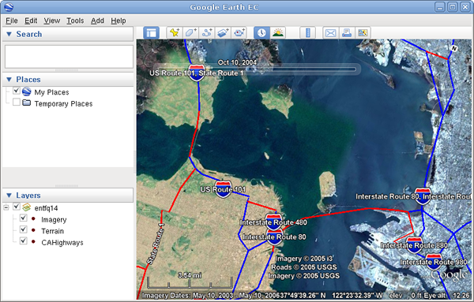
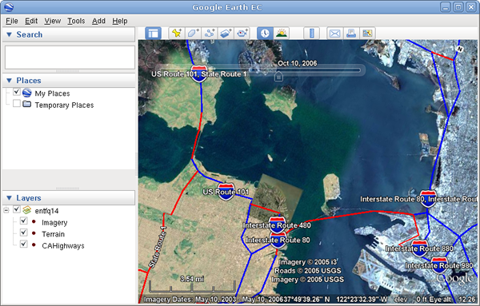

|Google logo|

=====================================
Building a Historical Imagery Project
=====================================

.. container::

   .. container:: content

      To build a historical imagery project:

      #. Follow the steps in :doc:`4412443` to define and build the
         following:

         +-------------+-------------+-------------+-------------+-------------+
         | Name        | Acquisition | Provider    | Mask        | Source file |
         | (Resources/ | Date        |             |             |             |
         | Imagery/... |             |             |             |             |
         | )           |             |             |             |             |
         +=============+=============+=============+=============+=============+
         | **BlueMarbl | Any date.   | NASA        | **No Mask** | ``bluemarbl |
         | e**         | The date of | Imagery     |             | e_4km.tif`` |
         |             | the base    |             |             |             |
         |             | image does  |             |             |             |
         |             | not affect  |             |             |             |
         |             | historical  |             |             |             |
         |             | imagery     |             |             |             |
         |             | browsing.   |             |             |             |
         +-------------+-------------+-------------+-------------+-------------+
         | **SFBayArea | 2002-10-10  | USGS        | **Auto      | ``usgsLanSa |
         | LanSat_2002 |             | Imagery     | Mask**      | t.tif``     |
         | 1010**      |             |             | **Tolerance |             |
         |             |             |             | **:         |             |
         |             |             |             | 2           |             |
         |             |             |             | Default for |             |
         |             |             |             | all other   |             |
         |             |             |             | mask        |             |
         |             |             |             | values.     |             |
         +-------------+-------------+-------------+-------------+-------------+
         | **i3_15Mete | 2004-10-10  | i3          | | **Auto    | ``i3SF15-me |
         | r_20041010* |             |             |   Mask**    | ter.tif``   |
         | *           |             |             | | Default   |             |
         |             |             |             |   values.   |             |
         +-------------+-------------+-------------+-------------+-------------+
         | **SFHighRes | 2006-10-10  | USGS        | **Auto      | ``usgsSFHiR |
         | Inset_20061 |             | Imagery     | Mask**      | es.tif``    |
         | 010**       |             |             | Default     |             |
         |             |             |             | values.     |             |
         +-------------+-------------+-------------+-------------+-------------+

      #. Open a new Imagery Project and add each of the image resources
         to the project:

         -  **Resources/Imagery/BlueMarble**
         -  **Resources/Imagery/SFBayAreaLanSat_20021010**
         -  **Resources/Imagery/i3_15Meter_20041010**
         -  **Resources/Imagery/SFHighResInset_20061010**

      #. Select the **Support Historical Imagery** checkbox.
      #. Select **File > Save**.
      #. Enter  **Projects/Imagery/SFBayAreaHistorical** as the name of your
         project and click **Save**.
      #. Build the **SFBayAreaHistorical** project.
      #. Create a new Earth Database and add the **SFBayAreaHistorical**
         project.
      #. Save the new database as **Databases/SFBayAreaHistorical**.
      #. Build and push the database to GEE Server, then publish it on
         GEE Server to the default **Publish point**.
      #. Launch Google Earth EC.
      #. Enter or select the host name or IP address of your server in
         the Server field, and specify the **Publish point** that you
         selected when you published your map database.

         For example, if you specify SFBayAreaHistorical-v001, it will
         be accessible from
         *myserver.mydomainname*.com/SFBayAreaHistorical-v001.

      #. Zoom in to the San Francisco Bay Area.
      #. Select the **Historical Imagery** toolbar button |Historical
         Imagery toolbar button| to display a time slider. The time
         slider allows you to move the view through time.

      | The following two screens show how this project is displayed in
        the Google Earth EC client. Notice the timeslider is visible and
        the differences between the imagery dates and content.
      | |Historical Image From Oct 10 2004|

      |Historical Image From Oct 10 2006|

.. |Google logo| image:: ../../art/common/googlelogo_color_260x88dp.png
   :width: 130px
   :height: 44px
.. |Historical Imagery toolbar button| image:: ../../art/fusion/tutorial/historical_imagery_button.png

