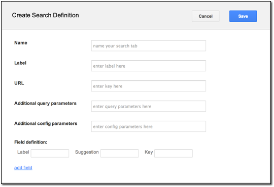
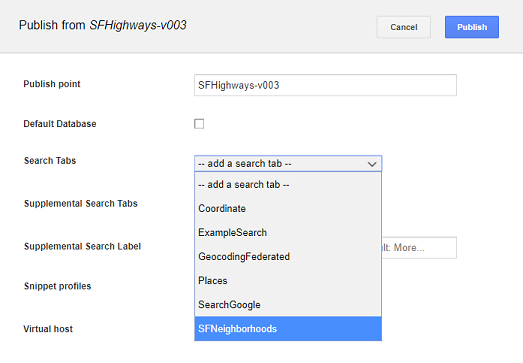
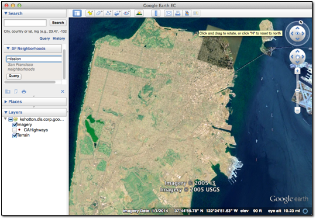

|Google logo|

=================================
Configuring a Searchable Database
=================================

.. container::

   .. container:: content

      Search tabs allow Google Earth EC and Google Maps users to search
      external databases on Google Earth Enterprise Servers as well as
      non-Google servers. For example, if you have a database of San
      Francisco neighborhoods that contains specific information that
      your users need about each neighborhood, you can add a search tab
      called SF Neighborhoods and configure it to search for
      neighborhoods in your database, even if that database is stored on
      another server. Google distributes some sample databases with the
      Google Earth Enterprise Server.

      The first thing you need to do is create a search tab definition
      using the Search tabs page of Google Earth Enterprise Server. Then
      you can associate the search tab with a published database. The
      exercises in this lesson show you how to perform both steps.

      -  :ref:`Define Search Tab <Define_Search_Tab>`
      -  :ref:`Add Search Tab To Your Database <Add_Search_Tab>`

      .. _Define_Search_Tab:
      .. rubric:: Define Search Tab

      .. rubric:: To define a new search tab:
         :name: to-define-a-new-search-tab

      #. Access the Google Earth Enterprise Server Admin console in a
         browser window by going to *myserver.mydomainname*.com/admin,
         replacing *myserver* and *mydomainname* with your server and
         domain.
      #. Sign in with the default credentials:

         -  Username: *geapacheuser*
         -  Password: *geeadmin*

      #. Click **Search tabs**.
      #. Click **Create** **new**. The Create Search Definition dialog
         appears.

         |Create Search Definition dialog|

      #. Enter **SFNeighborhoods** in the **Name** field as the unique
         name for your search tab.
      #. Enter **San Francisco Neighborhoods** in the **Label** field.

         This label will appear on the search tab that displays with
         your database in Google Earth EC.

      #. Enter **/gesearch/ExampleSearch** in the **URL** field.

         The **ExampleSearch** is one of the search plug-ins that are
         available with Google Earth Enterprise Server.
         **ExampleSearch** provides a searchable database of information
         about San Francisco neighborhoods.

      #. Enter **flyToFirstElement=true&displayKeys;=location** in the
         **Additional query parameters** field.

         These query parameters specify that Google Earth EC flies to
         the first element of your search results and displays the
         location key in the results.

         .. tip::

            When a Google Earth EC user specifies a search value,
            the Key value is associated with the value specified by the
            user and added to the ``URL GET`` request submitted to the
            example plug-in. It does not necessarily correlate to a field
            in the search database.

      #. For **Additional config parameters**, leave the field blank.
      #. For **Field Definitions**, enter **San Francisco Neighborhood**
         in the **Suggestion** field and **q** in the **Key** field.

         This is one of the plug-in examples supplied with Google Earth
         Enterprise Server. For more information about plug-ins for
         search tabs and the other fields in this dialog, see :doc:`../geeServerAdmin/createSearchTabs`.

      #. Click the **Save** button. Now the search tab is ready for you to add to
         your databases.

      .. _Add_Search_Tab:
      .. rubric:: Add Search Tab To Your Database

      .. rubric:: To add search tabs to your database:

      #. In Google Earth Enterprise Server, click **Databases** on the
         Admin console.

         The Databases page appears.

         |GEE Server Database Publish|

      #. Check the box next to the **SFHighways** database that you
         built in :doc:`../fusionTutorial/buildDatabase` and click **Unpublish**.

         The **Publish point** and **Virtual host** fields update to
         **unpublished**.

         Even though you published the database before, you must publish
         it again to include the new search tab.

      #. Click the **Publish** button. The Publish dialog appears.

         |Publish Search Definition dialog|

      #. Accept the default **Publish point** of the database name,
         **SFHighways** and the version number.
      #. Select **SFNeighborhoods** from the **Search Tabs** drop-down
         list.
      #. Click **Publish**.

         Google Earth Enterprise Server publishes the **SFHighways**
         database with the associated **SFNeighborhoods** search tab.

      #. Launch Google Earth EC and log in to your server.

      .. warning::

         If you have logged in to this server with Google
         Earth EC previously, log out, clear your cache, and log back
         in. See :doc:`../googleEarthEnterpriseClient/clearGoogleEarthEC`.

      Google Earth EC displays your database with the **SF
      Neighborhoods** search tab you specified.

      |EC Search Tab|

      |EC With Search Tab and Search Results|

.. |Google logo| image:: ../../art/common/googlelogo_color_260x88dp.png
   :width: 130px
   :height: 44px

.. |GEE Server Database Publish| image:: ../../art/fusion/tutorial/serverUnpublishSearchTab.png

.. |EC With Search Tab and Search Results| image:: ../../art/fusion/tutorial/ECSearchTab2.png
