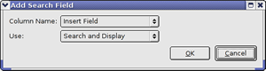
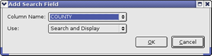
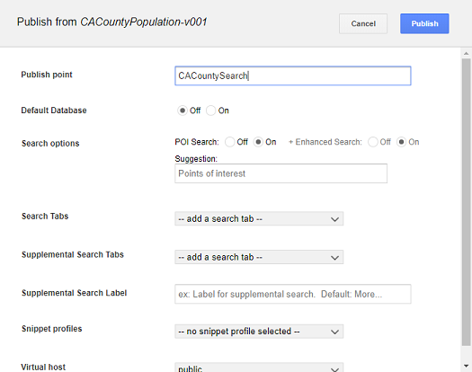
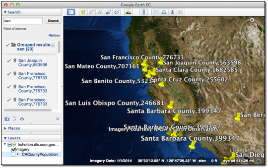

|Google logo|

==============================================
Specifying Search Fields for Individual Layers
==============================================

.. container::

   .. container:: content

      You can specify one or more fields by configuring layer properties
      in your source data on which users of Google Earth EC can search.
      This lesson guides you through the process of specifying one field
      on one layer as searchable, using the vector project you created
      in :doc:`../fusionTutorial/displayRulesPolygon`. If you have not yet completed
      that lesson, complete at least the first two sections,
      :ref:`Define and Build a Vector Resource Using Polygon Data <Define_Vector_Polygon>` and
      :ref:`Define, Configure, and Build a Vector Project <Define_Vector_Project1>`,
      before continuing with this lesson.

      -  :ref:`Specify Search Fields in Layer Properties <Specify_Search_Fields>`
      -  :ref:`Build and Push Your Database <Build_Push_Database>`
      -  :ref:`Specify Your Point of Interest Search and Publish Your
         Database in Google Earth Enterprise Server <Specify_POI_Search_Publish>`
      -  :ref:`View your Database with the Search Field <View_Database_Search_Field>`

      .. _Specify_Search_Fields:
      .. rubric:: Specify Search Fields in Layer Properties

      .. rubric:: To specify the search fields in your data:

      #. Select **Asset Manager** from the **Tools** menu.

         The Asset Manager appears.

      #. Navigate to the ``/ASSET_ROOT/Projects/Vector`` folder.
      #. Double-click **CACountyPopulation**.

         The **CACountyPopulation** resource appears in the Vector
         Project Editor dialog.

      #. Right-click **CACountyPopulation**, and select **Layer
         Properties** from the context menu.

         The Layer Properties dialog appears.

      #. Click the **Search** tab.

         |Layer Properties Search Tab|

         When you specify one or more search fields on this tab, a
         search panel appears in Google Earth EC that allows users to
         search for data in the selected field(s).

      #. Click |New Icon|. The **Add Search Field** dialog appears.

         |Layer Search Add|

      #. Select **COUNTY** from the drop-down list next to **Column Name**,
         select **Search and Display** from the drop-down list next to
         **Use**, and then click **OK**.

         |Search Field1|

         These selections allow users to search on the COUNTY field and
         display the county name in the description label.

      #. Click |New Icon|. The **Add Search Field** dialog appears.

         |Layer Search Add|

      #. Select **POP2000** from the drop-down list next to **Column Name**,
         select **Display Only** from the drop-down list next to **Use**,
         and then click **OK**.

         |Search Field2|

         These selections result in the county population being
         displayed in the description label for each county that matches
         the user’s search criteria. The first field selected for
         display becomes the placemark name. The second field selected
         for display becomes the snippet. Any additional fields selected
         for display become the description.

         .. note::

            This search performs an exact match, which means
            that the Google Earth EC user must enter the value exactly
            as it appears in the database. It can also perform a
            wildcard search, so users can enter part of the text they
            want to match. For example, if a user enters “dakota” in a
            state search, the search results match “North Dakota” and
            “South Dakota”.

         Your selections appear on the list of search fields on the
         Search panel in the order in which you added them. Use the Up
         or Down arrows to reorder the list.

         |Layer Properties Search Tab Full|

         The order in which the fields appear on this list dictates the
         order in which they appear in the description label in Google
         Earth EC.

      #. Click **OK**.
      #. Save the project.

      .. _Build_Push_Database:
      .. rubric:: Build and Push To Your Database

      #. In the Asset Manager, navigate to the ``/ASSET_ROOT/Databases``
         folder.
      #. Right-click the **CACountyPopulation** database and select
         **Build** from the context menu.

         The status of the database immediately changes to **Queued**
         and then to **In Progress**.

      #. Double-click the **Current Version** or **Current State** column of the
         **CACountyPopulation** to view the progress of the build.

         The Version Properties dialog displays the most recent version
         of that database. You can expand the version tree to view the
         status of the build in real time by clicking the **+** signs.

         When Google Earth Enterprise Fusion finishes building the
         database, its **Current State** column in the Asset Manager changes
         to **Succeeded**, and its **Current Version** column changes to the
         date and time the most recent build was started.

      #. Right-click the **CACountyPopulation** database and select
         **Push** from the context menu.

         The Push Database dialog appears. Choose your server
         association from the **Server Associations** drop-down list. The
         most recent version of the selected database is the default
         selection on the **Version** drop-down list.

      #. Click **Push**. Google Earth Enterprise Fusion pushes the
         database to Google Earth Enterprise Server, and displays a
         success message when it is done.

         .. note::

            If you get an error message, contact your Google
            Earth Enterprise Server administrator for help, or check the
            *Google Earth Enterprise Administration Guide* for more
            information.

      .. _Specify_POI_Search_Publish:
      .. rubric:: Specify Your Point of Interest Search and Publish Your
         Database in Google Earth Enterprise Server

      After you push your database to Google Earth Enterprise Server,
      you can publish it for viewing with Google Earth EC.

      .. rubric:: To publish a database:

      #. Access the Google Earth Enterprise Server Admin console in a
         browser window by going to *myserver.mydomainname*.com/admin,
         replacing *myserver* and *mydomainname* with your server and
         domain.
      #. Sign in with the default credentials or the username and
         password assigned to you:

         -  Default username: *geapacheuser*
         -  Default password: *geeadmin*

         .. note::

            If you do not know your username and password,
            contact your Google Earth Enterprise Server System
            Administrator.

      #. Click **Databases** to display the list of databases pushed to
         the server.

         CACountyPopulation-v001 is listed. The Description, Type, Date,
         and Size of the database are also noted.

      #. Check the box next to **CACountyPopulation-v001**. The **Publish**
         button on the Databases page appears.
      #. Click **Publish**. The Publish dialog appears.
      #. Select the **POI Search** radio button labeled **On**. The **+
         Enhanced Search** option appears. Leave its radio button
         setting as **On**. Doing so will first search against the *POI
         database*, and if no results are found, the *GeocodingFederated
         database* is automatically searched.
      #. Change the default **Publish point** from CACountyPopulation-v001
         to **CACountySearch**.

         |GEE Server Database Publish POI Search dialog|

         To learn more about the options available in the Publish
         dialog, see

         - :doc:`Default database <../geeServerAdmin/publishDefaultDatabase>`
         - :doc:`Search Tabs <../geeServerAdmin/createSearchTabs>`
         - :doc:`Snippet profiles <../geeServerAdmin/manageSnippetProfiles>`
         - :doc:`WMS <../geeServerAdmin/makeWMSRequests>`

      #. Click **Publish**. The Databases page updates to indicate the
         published status of your database.

      .. _View_Database_Search_Field:
      .. rubric:: View your Database with the Search Field

      Now you can view the POISearch search field in Google Earth EC and
      use it to search on the county information parameters you
      specified in your database.

      #. Launch Google Earth EC, and log in to your server.
      #. Specify the **Publish point** by entering or selecting the URL or
         IP address of your server and database in the **Server** field. For
         this tutorial, the **Publish point** is
         *myserver.mydomainname*.com/CACountySearch, where *myserver*
         and *mydomainname* are specific to your server. An example URL
         would be http://myhostname/CACountySearch.
      #. Click the **Sign In** button.

      .. warning::

         If you have logged in to this server with Google
         Earth EC previously, log out, clear your cache, and log back
         in. See :doc:`clearing your cache <../googleEarthEnterpriseClient/clearGoogleEarthEC>`.

      Google Earth EC displays your database with the search field you
      specified. When you enter a search string, such as “San”, all of
      the counties containing that string appear in the search results,
      and POI icons indicate the location of each of the search results
      on the map.

      |Database With POI Search Field|

.. |Google logo| image:: ../../art/common/googlelogo_color_260x88dp.png
   :width: 130px
   :height: 44px
.. |Layer Properties Search Tab| image:: ../../art/fusion/tutorial/layerProperties_SearchTab.png
.. |New Icon| image:: ../../art/fusion/tutorial/icon_new.gif

.. |Search Field2| image:: ../../art/fusion/tutorial/searchField2.png
.. |Layer Properties Search Tab Full| image:: ../../art/fusion/tutorial/layerProperties_SearchTab-full.png

