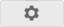
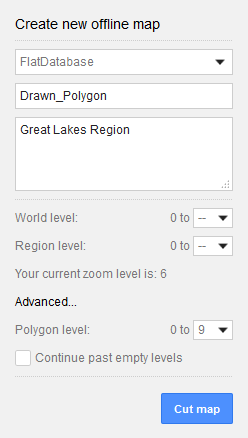
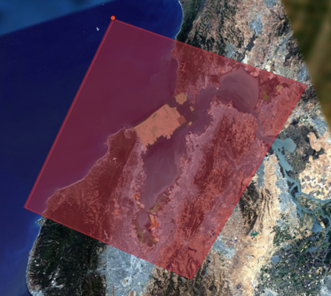

===============================
Create Portable Globes and Maps
===============================

.. container::

   .. container:: content

      |Google logo|

      When you are out in the field and you need a globe or map that can
      easily be stored and accessed from a desktop or laptop, you can
      create a portable globe or map by creating a *cut* of one of your
      databases. A portable globe or map is a single file (``.glb`` or
      ``.glc``) that stores all the geospatial data available within
      your specified area of interest—including all high-resolution
      imagery, terrain, vector data, KML files, and searchable point of
      interest (POI) locations. Outside the specified area of interest,
      the globe or map stores only low-resolution imagery and terrain.
      You specify the levels of resolution when you cut the globe or
      map.

      You can :doc:`create portable globes and maps <../geeServerAdmin/createPortableGlobesMaps>` with the
      :doc:`cutter tool <../geeServerAdmin/settingsPage>` feature of the :doc:`Google Earth Enterprise (GEE) Server <../geeServerAdmin/signInAdminConsole>`,
      from existing GEE portable files, or you can obtain them from third-party
      vendors. Depending on your area of coverage, it can take only a
      few minutes to specify and generate a globe or map and then save
      it to the GEE Portable maps directory.

      .. rubric:: Cut globes and maps from existing portable files

      With GEE 5.x, you can also cut globes and maps from existing
      portable files, which is convenient when you want to view a limited region
      of a previously cut globe or map, especially when your portable
      files are very large. This feature is often useful when you want
      to combine portable files with other ``.glb`` or ``.glc`` files to
      create a layered composite globe using the Assembly tool.

      To cut a globe or map from an existing portable file, first you
      must :ref:`register and publish <Register_Publish_Portable_Map_Globe>` it on :doc:`GEE Server <../geeServerAdmin/signInAdminConsole>`.

      .. tip::

         Cutting globes and maps from existing portable files is a new
         feature in GEE 5.x and is available with portable files that
         have been built using GEE 5.x only.

         If you attempt to cut a portable file that was created using
         GEE 4.x, the cutting process will fail. However, you can serve
         portable files created using previous versions.

         To determine which version of GEE was used to create a portable
         file, the timestamp information for the file is available for
         served globes or maps via
         ``http://localhost:9335/earth/info.txt`` on a local Portable
         Server, or ``http://<server>/<mount_point>/earth/info.txt`` on
         Earth Server. In addition you can get the timestamp information
         using ``geglxinfo``, the GEE tool for inspecting portable
         files.

      .. rubric:: Inspect portable files for timestamp information

      To help you identify which version of GEE was used to create a
      portable file, you can use the portable inspection tool,
      ``geglxinfo``, to get the timestamp for when the portable file was
      created. This information should give you a good idea of which
      version of GEE was used to create the file. Extract and output the
      ``earth/info.txt`` file, as in the following example use of the
      command:

      .. code-block:: none

         $ geglxinfo --glx tutorial_3d.glc --extract_file earth/info.txt --output /tmp/info.txt
         $ cat /tmp/info.txt
         Portable Globe
         Copyright 2013 Google Inc. All Rights Reserved.
         2014-01-15 16:03:15 GMT

         2014-01-15 08:03:15
         Globe description: Simple container for tutorial glb with gray marble backdrop.
         2014-01-15 08:03:15
         Executing: /opt/google/bin/gecreatemetadbroot --output="/tmp/cutter/glc_20598_1389801795.111116/metadbroot" --layers="/tmp/cutter/glc_20598_1389801795.111116/earth/dbroot_layer_info.txt"  --has_base_imagery

         2014-01-15 08:03:15
         SUCCESS
         2014-01-15 08:03:15
         Executing: /opt/google/bin/geportableglcpacker --layer_info="/tmp/cutter/glc_20598_1389801795.111116/earth/layer_info.txt" --output="/tmp/cutter/glc_20598_1389801795.111116/temp.glc" --make_copy

      .. rubric:: Composite globes and maps

      Portable globes and maps can also be assembled into layers to
      create a composite globe or map, a single file (``.glc``) that
      contains all the geospatial data for assembled layers. To assemble
      a composite file, you supply a KML polygon to cut your area of
      interest, then specify the layers and the order in which they display.
      See :doc:`../geeServerAdmin/createCompositeGlobesMaps`.

      .. rubric:: Create a portable globe or map

      Cutting a globe or map is accomplished with a simple web
      interface. You import a KML, or use your mouse, to define a polygon,
      which defines your "area of interest." This polygon not only
      defines the area that displays high-resolution imagery, but is
      also used by Fusion to create a localized search database.

      .. note::

         The cutting processes are CPU- and disk-intensive, as
         they are retrieving all data within the specified polygon from
         the Earth Enterprise Server. This can affect the overall
         performance of the Server, including slowing end-user access.

         To mitigate performance impact to end users, you may consider:

         -  Limiting the number of users with access to cutting.
         -  Creating pre-cut portable globes to host as downloadable
            files for portable users.
         -  Operating a separate GEE Server specifically to support
            on-demand cutting needs.

         Please contact the Google Earth Enterprise Support team for
         further information or questions about these procedures.

      .. rubric:: Before you begin

      .. rubric:: Enable the cutter

      Before cutting a globe, you must enable the cutter from the
      command line:

      -  In GEE 5.x: ``gecutter enable``
      -  In earlier versions: ``geserveradmin --enable_cutter``

      For more information about ``geserveradmin``, see the :doc:`../fusionAdministration/commandReference`.

      **Note about authentication and SSL**: Cutting is not currently
      supported on globes or maps that require end-user authentication,
      such as LDAP. One workaround is to allow unauthenticated access
      from localhost on your Earth Enterprise Server. Refer to Apache
      documentation to enable such a configuration. Cutting of a globe
      over HTTPS is supported; however, the SSL certificate of the target
      server will not be verified during cutting.

      .. rubric:: The globe cutter interface

      .. rubric:: To create a portable globe:

      #. Access the Google Earth Enterprise Server Admin console in a
         browser window by going to *myserver.mydomainname*.com/admin,
         replacing *myserver* and *mydomainname* with your server and
         domain.
      #. Sign in with the default credentials or the username and
         password assigned to you:

         -  Default username: geapacheuser
         -  Default password: geeadmin

         .. note::

            If you do not know your username and password,
            contact your Google Earth Enterprise Server System
            Administrator.

      #. Click **Databases** to display the list of databases and
         portables pushed to the Server.
      #. Click the |Settings button| **Settings** button in the top right of the window
         and select **Launch Cutter** from the **Tools** menu.

         A new browser tab opens with the GEE Server — Cutting Tool and
         the **Create new offline map** window appears.

         |GEE Cutter create offline map window|

         .. rubric:: Map or globe name

      #. Use the drop-down menu to select the database or portable you wish
         to cut to create your offline map or globe.
      #. Enter a name for the offline map or globe.

         The name defines the file name for your offline map or globe.
         Offline maps are created as ``.glm`` files; offline globes are
         created as ``.glb`` files. Both file types are a single-file
         format for sharing Google Earth Enterprise maps and globes.
         Spaces, slashes, and double dots (..) will be converted to
         underscores in the saved globe name.

         .. warning::

            Building an offline map or globe will overwrite any existing
            offline maps or globes with the same name. If multiple users
            are cutting maps or globes, we recommend assigning unique
            prefixes to each user for their globe names to ensure that
            files are not accidentally overwritten.

      #. Enter a description to be associated with the offline map or
         globe.

         We recommend adding sufficient descriptive information for each
         offline map or globe, so that others will know what geographic
         area, or what mission, they were created for.

      #. If you are overwriting an existing cut, select **Yes** for **Overwrite?**.

      .. rubric:: Drawing the polygon

      Once the globe or map name has been specified, you can define the
      geographic region to be cut by drawing a polygon on the globe.
      There are two ways to draw the polygon.

      .. rubric:: Hand drawing the polygon

      .. warning::

         When cutting a 3D globe this method is only available if you
         are running the discontinued Google Earth Plug-in in your
         browser. This method works for cutting 2D maps from your
         browser.

      #. By default, you draw a polygon by hand so the **Select Region**
         drop-down list is set to **Manual**.
      #. Use the |Pan tool| **Hand** tool to pan, then, using the navigation
         controls in the plug-in, zoom in to the region of interest.
      #. To use your mouse to define the polygon, click the |Polygon icon| polygon icon
         in the globe window.
      #. Click on the map or globe to define each point. You can use the
         navigation controls on the right to move the globe or change
         zoom levels while drawing.
      #. Click the final point at the point of origin to complete the polygon selection.

         |Polygon example|

      #. If you need to redraw the polygon, click **Clear** to delete the polygon you just created.

      .. rubric:: Defining the polygon with KML

      You can also use KML to define the polygon(s). The KML should be
      complete, and may contain single or multiple elements.

      **To insert your KML:**

      #. From the **Select Region** drop-down list, select **Paste
         KML**. The Paste KML window appears.
      #. Paste your KML into the text field, then click **Use KML**.

         GEE Server validates the KML and then draws the polygon using
         the KML data you provided. Your polygon appears on the map or
         globe (the latter only if you have the discontinued Google
         Earth plug-in running in your browser).

      .. rubric:: Globe resolution

      The polygon you specified in the previous step defines your *area of
      interest*. This area contains high-resolution imagery and data,
      and search tabs are created for vector data within this zone. The
      maximum and minimum resolutions are specified as integers between
      1 and 24. These correspond to the zoom levels that are used in the
      Fusion server. Setting a resolution of 24 results in a cut of the
      entire globe.

      .. container:: warning

         **Caution:** Setting a resolution of 24 to cut an entire globe
         may result in a very large file.

      .. rubric:: World level resolution
         :name: world-level-resolution

      The area outside of the defined polygon is included in the globe
      at a lower resolution, which you set using **World level**. Areas
      near the polygon may be included at a higher resolution.

      -  To set the world level resolution, select a value from the
         **World level** drop-down list.

      A minimum zoom level of 5-7 presents a decent-looking world to the
      user and is most likely to include vector layers such as
      international boundaries and state boundaries and main cities
      without affecting the size of the ``.glb`` file very much. For
      example:

      -  A cut globe with minimum and maximum resolution values set to 5
         is 10 MB.
      -  A cut globe with minimum and maximum resolution values set to 6
         is 41 MB.
      -  A cut globe with minimum and maximum resolution values set to 7
         is 120 MB.

      These numbers are small in comparison to the overall size of your
      globe when a suitable maximum resolution has been selected. For
      example, a globe that contains all of the city of Atlanta, GA, USA
      in 1-foot resolution requires approximately 5 GB of storage. Even
      level 7 imagery, at 120 MB, is a small percentage of the overall
      globe size. You can also leave this field blank to use the highest
      available imagery.

      .. rubric:: Region level resolution

      The zoom level for the polygon area is set using **Region level**.

      The maximum resolution of the cut polygon area is no higher than
      the maximum resolution of the source map or globe. For example, if
      the maximum resolution in the cutter is specified at 24, but the
      source imagery is at 18 (approximately 1-meter resolution), the
      cut map or globe will contain level 18 imagery. You can leave this
      field blank to use the highest available imagery.

      You may enter a lower number to reduce the size of your map or
      globe by not including the highest resolution imagery.

      .. rubric:: Advanced Settings

      .. rubric:: Polygon Resolution

      The **Advanced** option provides an additional globe-cutting
      option, namely *Polygon Resolution*. This setting is useful when
      cutting with large polygons. For example, you may use 12 for a
      country-sized polygon or 18 for a city-sized polygon.

      .. rubric:: To set the polygon resolution:

      -  Click **Advanced** to display the **Polygon Resolution** option.
      -  Click the drop-down list to set the resolution value you want.

      .. rubric:: Continue Past Empty Levels

      This option only applies to portable maps (2D databases). If a
      portable map does not contain imagery in the polygon at the
      resolution that you think it should, try recreating the portable
      map with this option set to **Yes**. This option will likely increase
      the build time, possibly significantly.

      .. note::

         Additional advanced settings may be offered in future
         versions. Use caution when changing them as they may
         dramatically increase build times and globe sizes.

      .. rubric:: Building the map or globe

      Depending on the size of your polygon, building a cut map or
      globe can take a few minutes to a few hours; likewise, file
      size varies widely depending on the area selected and the desired
      resolution.

      .. rubric:: To build the map or globe:

      -  Click **Cut map** to start the build process.

         The progress of the build appears in the **Build** window.

         When the build is finished, a ``.glb`` file is created in the
         default globes directory,
         ``/opt/google/gehttpd/htdocs/cutter/globes``, and a download
         link appears to the file's location on GEE Server.

      .. rubric:: KML files

      When a portable globe is cut from a source containing KML links
      in the Layer panel:

      -  KML files that are stored locally on the primary Earth
         Server will be bundled into the portable globe. Only the
         main KML file will be copied, not any links or files that
         are embedded as links in the main KML file. The default copy
         is not recursive.
      -  KML links that refer to servers other than the primary Earth
         Server are not copied. The layer will be visible in the
         client, but clicking the link will not cause any data to be
         displayed. If access to external servers is needed, a small
         KML file should be stored locally on the primary Earth
         Server. This KML file should contain a link to the intended
         external server.

      .. rubric:: Historical Imagery

      Historical Imagery is not supported in the portable globe as of
      Fusion 4.2.

      There are, however, two situations in which historic imagery
      will be displayed:

      -  When the computer running the portable globe has a
         connection to the Earth server from which the globe was cut.
         In this case, historic imagery can be streamed from the
         Earth server. Once in the field, however, and disconnected
         from the Earth server, no historic imagery will be
         displayed.
      -  If historic imagery has been cached on the portable globe
         machine.

      Otherwise, the following error message will appear:

         **Google Earth can't contact the imagery server to download
         new images.**
         You will be able to see areas that you have been to recently,
         but new image areas may appear blurry.

      .. rubric:: Learn more

      -  :ref:`Serve a globe or map from GEE Portable <Serve_Globe_Map_GEE_Portable>`
      -  :ref:`Connect with GEE Portable <Connect_GEE_Portable>` for
         different ways you can connect to GEE Portable to view your
         offline maps and globes.
      -  :doc:`../portable/portableDeveloperGuide` for ways
         to customize or extend GEE Portable, or create applications
         that work with it.

.. |Google logo| image:: ../../art/common/googlelogo_color_260x88dp.png
   :width: 130px
   :height: 44px

.. |Pan tool| image:: ../../art/fusion/portable/cutterHandTool2.png
.. |Polygon icon| image:: ../../art/fusion/portable/cutterPolygonTool.png

