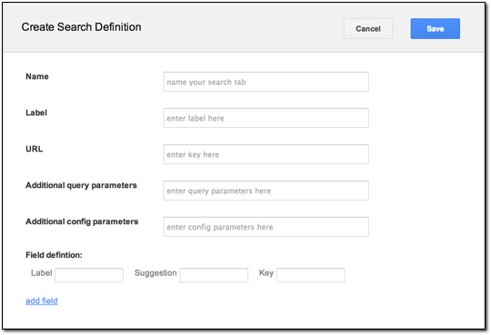
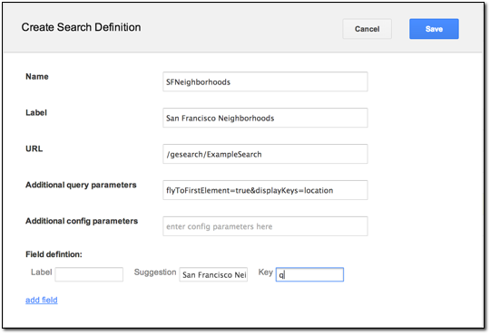

|Google logo|

==================
Create Search tabs
==================

.. container::

   .. container:: content

      You can create search tabs in GEE to add search services that let
      you query GEE Server using Google Earth Enterprise Client (EC) or
      a Google Map (http://maps.google.com/).

      Search tabs allow Google Earth EC or Google Maps users to:

      -  Replace the standard search tabs in Google Earth EC.
      -  Search 2D or 3D databases created with Google Earth Enterprise
         Fusion.
      -  Access other databases not related to Google Earth Enterprise
         Fusion (such as geocoders, Google Search Appliance, and so on).
      -  Access external search servers (such as a real estate search).

      For example, if you have a database of property locations that
      contains specific information that your users need, you can create
      a search tab called *Property Search* and configure it to search
      for locations in your property database, even if that database is
      stored on another server.

      You can also create search tabs with *multiple fields*. For
      example, you might create a Driving Directions search tab with
      *From* and *To* labels in the Create Search Definition dialog. You
      populate the URL field with the custom service that returns the
      actual directions.

      The **Search tabs** page of Google Earth Enterprise Server allows
      you to pre-configure the search tabs to be used for any Fusion
      database. You define all of the search tabs using the
      **Search tabs** page, and then you select one or more search tabs
      for a specific database when you publish it using the **Databases**
      page. See :doc:`../geeServerAdmin/publishDatabasesPortables` for details.

      .. rubric:: Define a new search tab

      To define a new search tab:

      #. In the :doc:`GEE Server Admin console <../geeServerAdmin/signInAdminConsole>`,
         click **Search tabs**.
      #. Click **Create** **new**. The Create Search Definition dialog appears.

         |Create Search Definition dialog|

      #. Enter a unique **Name** for your search tab.
      #. Enter a **Label** that will display as the name of the search tab in the client.
      #. Provide a **URL**.
      #. If you want to reference a Google Earth Enterprise Server plug-in for the
         search tab, enter the name of the plug-in. The following plug-ins are available:

         -  POISearch
         -  /gesearch/FederatedSearch
         -  /gesearch/CoordinateSearch
         -  /gesearch/PlacesSearch
         -  /gesearch/ExampleSearch

      #. Optionally provide additional query parameters.
         The syntax is **key1=value1&key2;=value2**. For example,
         **flyToFirstElement=true&displayKeys;=location** flies to
         the first element of your search results and displays the
         Location key in the results. Google Earth EC must be able to
         understand and respond to these key/value pairs, so you must
         be very familiar with your search application to use this
         field.

         .. warning::

            Any web service, servlet, or web application
            you configure the search tabs to query must return valid KML
            to Google Earth EC. For Google Maps, it must return valid
            JavaScript in the specified structure.

      #. Optionally provide additional config parameters.
         Specify the following field parameters:

         a. **Label**: Label of the search box.
         b. **Suggestion**: Suggestion to the user of what to search for.
         c. **Key**: The parameter name that the value in the text
            box will be assigned when the search is submitted.

      #. Optionally click **add field** to add another set of search
         field parameters.

      #. Click **Save**.

      |Create Search Definition dialog Full|

      The search tab is ready for you to add to your database. See
      :doc:`../geeServerAdmin/publishDatabasesPortables` for details.

      .. rubric:: Customize search tab style in Google Earth EC

      You may want to customize the appearance of the search tabs
      as they display in Google Earth EC. You can edit
      ``/opt/google/gehttpd/htdocs/earth/supplemental_ui.html`` to
      change the style and various elements for the search form
      that appears. The changes you make are then included in the
      database at the time you publish.

      To customize the style and elements of a search tab:

      #. Make a backup copy of
         ``/opt/google/gehttpd/htdocs/earth/supplemental_ui.html``
         and open your renamed file for edit.
      #. In the HTML code, update the style and display elements
         to customize your search form.
      #. Save the HTML file with the name you want to use for your
         search tabs, e.g.,
         ``/opt/google/gehttpd/htdocs/earth/search_supplemental_ui_MySearchTab.html``.
      #. Publish your database with the selected search tab(s).
      #. View your database in Google Earth EC.

         Search tabs now appear with the style and element
         settings that you customized.

.. |Google logo| image:: ../../art/common/googlelogo_color_260x88dp.png
   :width: 130px
   :height: 44px

