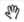

|Google logo|

=============
Settings page
=============

.. container::

   .. container:: content

      Click the |gear icon| **Settings** icon in the :doc:`GEE Server Admin
      console <../geeServerAdmin/signInAdminConsole>` to:

      .. rubric:: Perform .glc assembly

      To create new .glc globes from existing globes (.glm/.glb):

      #. Enter a name and description for the new .glc.
      #. Paste **Polygon** KML for use with the new globe.
      #. Select either **2D** layers to build a .glc using selected
         layers of existing .glm files, or **3D** layers to build a
         .glc using .glb files at the layers.
      #. Click **Assemble .glc**.

      .glc files are added to the default globes directory when
      they are created.

      See :doc:`../geeServerAdmin/createCompositeGlobesMaps`.

      .. rubric::  Perform .glc disassembly

      To extract .glm/.glb files:

      #. Select a .glc to disassemble.
      #. Enter a **New output directory** where the files will be
         placed.
      #. Click **Disassemble glc**.

      See :doc:`../geeServerAdmin/createCompositeGlobesMaps`.

      .. rubric:: Launch Cutter

      To create a new .glm/.glb from published Fusion databases or
      Portable globes (.glm/.glb, not .glc):

      #. Select a source map.
      #. Enter a name for the offline map or globe.
      #. If you have entered a globe name that is already in use, a warning
         is displayed. If you wish to overwrite the existing cut, select
         the **Overwrite** check box. If you do not wish to overwrite the
         existing cut, modify the globe name.
      #. Enter a description to be associated with the offline map or
         globe.
      #. Use the |Pan tool| **Hand** tool to pan, then, using the navigation
         controls in the plug-in, zoom in to the region of interest.
      #. Select the geographic region you wish to cut using one of the following
         methods: 

         -  To use your mouse to define the polygon, click the |Polygon icon| **Draw Polygon**
            button on the toolbar in the globe window and follow the
            directions onscreen.
         -  To use KML to define the polygon, click the |KML| **KML** button
            on the toolbar at the top of the window and paste either:

            -  the complete polygon placemark from the KML; or
            -  the entire KML file. Please note that if the KML file
               contains multiple elements, the first element will be
               used to define the polygon.

      #. Specify a **World level**; this represents the highest
         resolution at which the entire world will be available.
      #. Optionally use the zoom buttons in the lower-right of the
         map to change your zoom level. This represents the
         highest resolution at which the data within the region of
         interest will be available.
      #. Click **Cut map**.

      The cut progress will be displayed at the bottom of the
      screen. Upon successful completion, the globe is saved to
      the default globes directory.

      See :doc:`../geeServerAdmin/createPortableGlobesMaps`.

      .. rubric:: View Apache logs

      View Apache logs for troubleshooting errors or unexpected
      behavior with GEE Server.

.. |Google logo| image:: ../../art/common/googlelogo_color_260x88dp.png
   :width: 130px
   :height: 44px
.. |gear icon| image:: ../../art/server/admin/accounts_icon_gear_padded.gif

