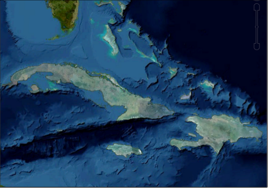

|Google logo|

======================
Release notes: GEE 5.0
======================

.. container::

   .. container:: content

      This document includes the following information about the Google
      Earth Enterprise 5.0 release:

      .. rubric:: Overview

      GEE 5.0 introduces a flexible and dynamic approach to publishing
      maps and globes. When publishing, you specify unique options for a
      map or globe at a given URL; the map or globe can then be easily
      published multiple times at different URLs with different
      configurations. Likewise, particular configurations can quickly be
      unpublished or modified.

      Virtual hosts (previously called virtual servers) now only specify
      a security protocol and can be associated with multiple published
      globes and maps. This decouples the task of setting up security
      protocols from publishing maps and globes.

      Associating search sets and snippets at the time of publishing
      allows you to present different versions on the same underlying
      Fusion database, which can then be made available at different
      URLs and under different security protocols. For example, to
      protect one set of searchable data but display it on the same
      globe as you do an unprotected set of searchable data. You might
      then publish the database at one URL with the sensitive search and
      a secured virtual host, then publish the same database at a
      different URL with a non-sensitive search and public virtual host.

      All of this can be done in a matter of seconds from the new GEE
      Server Admin console, and no longer requires interaction with
      Fusion. We hope that this new publishing approach makes your life
      easier and maybe even a little more fun!

      .. rubric:: Supported Platforms

      The Google Earth Enterprise 5.0 release is supported on 64-bit
      versions of the following operating systems:

      -  Ubuntu 10.04 LTS and 12.04 LTS
      -  Red Hat Enterprise Linux versions 6.0 to 6.5, including the
         most recent security patches
      -  CentOS 6.5

      GEE 5.0 is compatible with Google Earth Enterprise Client (EC) and
      Plugin versions 7.0.1 - 7.1.1.1888 for Windows, Mac, and Linux.

      .. rubric:: New Features

      **GEE Server:**

      -  New GEE Server Admin console for managing and publishing maps
         and globes, available at *myserver.mydomainname*.com/admin. The
         default credentials are:

         -  Username: geapacheuser
         -  Password: geeadmin
         -  To reset the username and password:
            ``sudo /opt/google/gehttpd/bin/htpasswd -c /opt/google/gehttpd/conf.d/.htpasswd geapacheuser``

      -  From the GEE Server Admin console:

         -  Publish databases and portables using easily-specified
            publish points.
         -  Publish one map or globe to multiple URLs with multi-target
            publishing. Each publish point can have a different set of
            end_snippets and search services for a served database.
         -  Register portables for easy managing and publishing.
         -  Easily crate and associate snippets with your databases
            while publishing using Snippet profiles.
         -  Define and add multiple search tabs.

      -  New publishing and serving backend that does not require server
         restart while publishing.
      -  Upgrades to support the latest Google Earth protocol, allowing
         alpha-masked imagery and modern imagery packet specification
         (supported by Earth EC versions 7.0 and later).
      -  Native WMS capability: Use GEE Server as a WMS endpoint to
         serve layers from 3D globes and 2D maps.

      **Fusion:**

      -  Alpha-masked imagery for publishing imagery insets that will
         seamlessly overlay on top of other GEE 3D databases.

         |GEE Version 4.4 mask with black pixels|

         *Imagery project consisting of only a high-resolution inset*

         |GEE version 5.0 alpha mask|

         *Addition of secondary database with worldwide lower-resolution
         imagery*
         Build a new view for your globes from multiple databases that use
         different terrain resolutions.
         Support for GeoTIFF files larger than 4GB.
      **Google Earth Enterprise Server cutting feature:**

      -  New user interface to simplify the Portable cutting process.
      -  Support for cutting portable globes and maps from either .glbs
         or .glms files.
      -  Enable cutter using ``gecutter enable``

      **New Directory Structure for Google Maps Javascript Maps API:**

      -  The current Google Maps Javascript Maps API V3 is 3.12.17. Maps
         API 3.9.x and later uses a simplified directory structure. In
         the new structure, the latest version of Maps API is always in
         /maps/api. To upgrade to 3.12.17, change your code to upload
         from the /maps/api directory. To load the new Maps API from the
         /maps/api directory, preface your code with these lines:
         ````
         ````
         ````
         Visit `this
         link <https://code.google.com/p/gee-samples/source/browse/trunk/FusionMapsExamples/gee_maps_polyline_sample.html>`_
         To view or download sample code that loads Maps API 3.9.x.

      **Native WMS from GEE Server:**

      Google Earth Enterprise Server 5.0 supports the GetCapabilities
      and GetMap requests for WMS versions 1.1.1 and 1.3.0. To enable
      WMS for a database you want to publish:

      #. In the :doc:`GEE Server Admin console <../geeServerAdmin/signInAdminConsole>`_,
         click **Databases.**
      #. Check the box next to the database you want to publish.
      #. Click **Publish**.
      #. Next to **Serve WMS**, select **On**.

      **Serve Flat maps as Mercator:::

      The GEE Server doesn’t let you serve Plate Carrée (flat) maps, but
      WMS can rebuild your Plate Carrée maps as Mercator maps. If you
      republish your maps, WMS serves your Plate Carrée imagery tiles as
      Mercator. You can use Fusion to build your own Mercator vector
      layer to overlay on the imagery tiles. The client combines the
      layers when it displays the map. Note: The Google Maps API uses
      the Mercator projection and Google’s iOS and Android apps only
      display Mercator maps.

      **Change your projection:**

      You can use a third-party application like MapServer to reproject
      your native WMS on-the-fly (for example, to change your projection
      from Mercator to Finnish National Coordinate System). GEE supports
      most GDAL projections.

      .. rubric:: Third-party Library Updates:

      -  GDAL 1.10.0 compiled with support for:

         -  BigTIFF (TIFF files larger than 2 GB)
         -  Python bindings (See
            `examples <http://trac.osgeo.org/gdal/wiki/GdalOgrInPython)>`_)

      -  Apache 2.2.25
      -  Apache httpd 2.2.23
      -  libattr 2.4.46
      -  libcap 2.19
      -  libmng 1.0.10
      -  libjpeg 8.0
      -  Python 2.7.5
      -  No Java dependencies (JDK, Tomcat connectors, mod_jk) in Fusion
         and Server. You still need a valid JRE (any version) to run the
         installers.

      .. rubric:: Known Issues

      +-----------------------+-----------------------+-----------------------+
      | Number                | Description           | Workaround            |
      +=======================+=======================+=======================+
      | 7239735               | If libc.so.6 is       | Ignore the message    |
      |                       | located in a          | and continue to       |
      |                       | directory other than  | install or uninstall. |
      |                       | /lib, the installer   |                       |
      |                       | and uninstaller       |                       |
      |                       | display a message     |                       |
      |                       | that /lib/libc.so.6   |                       |
      |                       | is missing. No known  |                       |
      |                       | problems are          |                       |
      |                       | associated.           |                       |
      +-----------------------+-----------------------+-----------------------+
      | 7531358               | Each terrain project  | Include a             |
      |                       | (even terrain insets) | low-resolution global |
      |                       | must have worldwide   | terrain resource such |
      |                       | resource. If not, the | as Gtopo (land only)  |
      |                       | build fails with a    | or Etopo (bathymetry  |
      |                       | "Fusion Fatal: Empty  | and land) with the    |
      |                       | inset stack" error.   | terrain project, and  |
      |                       | This error is         | then rebuild the      |
      |                       | typically caused by   | database.             |
      |                       | the terrain project   |                       |
      |                       | not having a base     |                       |
      |                       | terrain resource with |                       |
      |                       | complete global       |                       |
      |                       | coverage.             |                       |
      +-----------------------+-----------------------+-----------------------+
      | 11715339              | The Preview option in | #. Make a backup of   |
      |                       | the GEE Server Admin  |    ``/opt/google/geht |
      |                       | console Databases     | tp/htdocs/earth       |
      |                       | window fails to       |          /earth_local |
      |                       | display any preview   | .html``.              |
      |                       | for Fusion 3D         | #. Change line 84 in  |
      |                       | databases.            |    that file from:    |
      |                       |                       |    ``earthArgs = {dat |
      |                       |                       | abase: GEE_BASE_URL + |
      |                       |                       |  window.location.href |
      |                       |                       | };``                  |
      |                       |                       |    to                 |
      |                       |                       |    ``earthArgs = {dat |
      |                       |                       | abase: window.locatio |
      |                       |                       | n.href};``            |
      +-----------------------+-----------------------+-----------------------+

      .. rubric:: Resolved Issues

      +-----------------------+-----------------------+-----------------------+
      | Number                | Description           | Resolution            |
      +=======================+=======================+=======================+
      | 7443814               | Certain polygon       | Fixed in Fusion       |
      |                       | datasets with invalid | vector processing     |
      |                       | geometries cause      | pipeline.             |
      |                       | Fusion processing to  |                       |
      |                       | hang.                 |                       |
      +-----------------------+-----------------------+-----------------------+
      | 7442639               | GEE supports only one | The 5.0 release       |
      |                       | field per custom      | supports EC 7.0 and   |
      |                       | Search tab in EC 6.2  | later. To include     |
      |                       | and later. If you     | multiple Search tab   |
      |                       | want to include       | fields for EC 7.0 or  |
      |                       | multiple fields in    | later:                |
      |                       | your Search tabs, use |                       |
      |                       | EC 6.1.               | #. Go to GEE Server   |
      |                       |                       |    admin console at   |
      |                       |                       |    http://localhost/a |
      |                       |                       | dmin.                 |
      |                       |                       | #. Click **Search     |
      |                       |                       |    tabs**.            |
      |                       |                       | #. Click **Create     |
      |                       |                       |    new**.             |
      |                       |                       | #. Enter your first   |
      |                       |                       |    field definition,  |
      |                       |                       |    then click **Add   |
      |                       |                       |    field.** You can   |
      |                       |                       |    add as many fields |
      |                       |                       |    as you want.       |
      +-----------------------+-----------------------+-----------------------+
      | 6888196               | Publish fails with    | Fixed in POI-file     |
      |                       | "Unable to parse POI  | parsing scheme and    |
      |                       | file" in log.         | POI data managing.    |
      +-----------------------+-----------------------+-----------------------+
      | 5570955               | Postgres service      | Fixed in installer.   |
      |                       | running after GEE     |                       |
      |                       | Server installer      |                       |
      |                       | exits.                |                       |
      +-----------------------+-----------------------+-----------------------+
      | 7521159               | A double slash in the | Fixed in asset        |
      |                       | -o option breaks      | managing scheme.      |
      |                       | genewterrainproject.  |                       |
      +-----------------------+-----------------------+-----------------------+
      | 885079                | Ability to assign     | Fixed with new        |
      |                       | dbroot snippets at    | publisher.            |
      |                       | database and virtual  |                       |
      |                       | server level.         |                       |
      +-----------------------+-----------------------+-----------------------+
      | 6611496               | geserveradmin reports | Fixed in publisher    |
      |                       | successful delete for | back end.             |
      |                       | nonexistent entities. |                       |
      +-----------------------+-----------------------+-----------------------+

.. |Google logo| image:: ../../art/common/googlelogo_color_260x88dp.png
   :width: 130px
   :height: 44px
.. |GEE Version 4.4 mask with black pixels| image:: ../../art/fusion/alpha_mask/alphamask1.png

